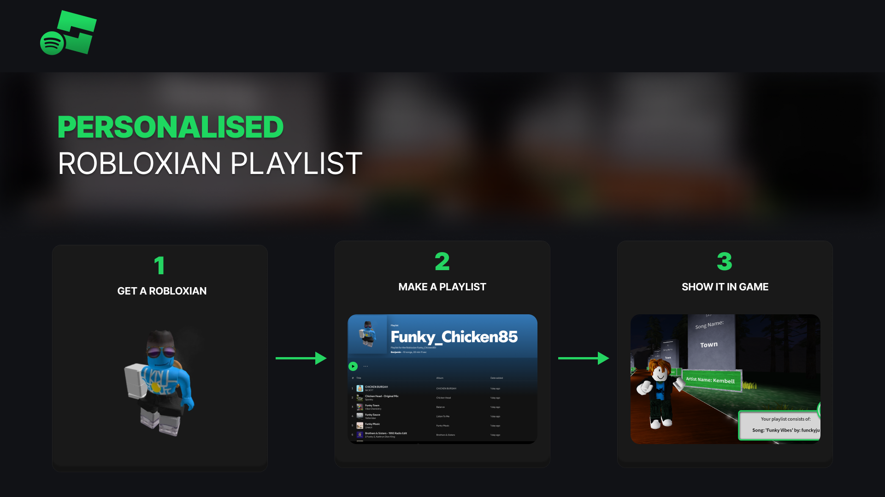
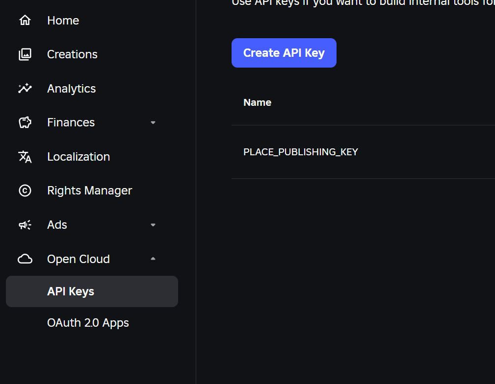
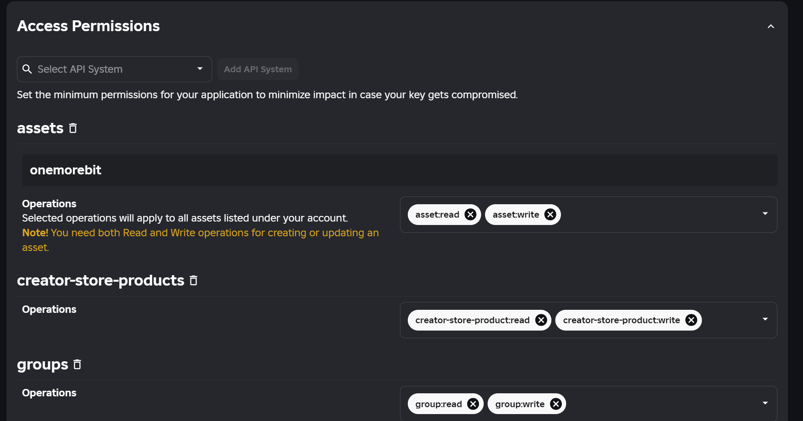

<p align="right">
<br/>
  
</p>

# Spotify Roblox API Project

## Description
This project showcases the integration of the Roblox API and Spotify API to create an interactive experience that bridges the two platforms. 

Users can input a word, which is used to find the closest matching Roblox username (excluding display names). The code then creates a Spotify playlist based on that username and includes the user's profile picture in the playlist. 

Additionally, the Roblox API is utilized to display the song and artist name from the playlist within Roblox by editing a Roblox script.





## Table of Contents
- [APIs and API Keys](#apis-and-api-keys)
- [Installation](#installation)
- [Directory Structure](#directory-structure)
- [Configuration](#configuration)
- [Acknowledgements](#acknowledgements)
- [Future Improvements](#future-improvements)
- [Video Demonstrations](#video-demonstrations)

## APIs and API Keys

### Spotify
To use the Spotify API, please visit the [Spotify Developer's website](https://developer.spotify.com). You will need to obtain the following:

- Username
- Client ID
- Client Secret
- Redirect URI (can be set to a placeholder like `https://google.com`)

### Roblox
Using the Roblox API can be more complex due to recent changes. Start by visiting the Creator Hub and navigating to **Cloud > API Keys**, as shown in the image below .


Next, adjust the scope manually to specify which game this key applies to, as illustrated in this picture. 

You will need to obtain the following:
-  api_key
- client_id
- client_secret 
- redirect_uri = http://localhost:3000/oauth/callback
- cookie 

**Note:** Roblox offers two types of verification: OAuth2 and API Key. For this script, only the API Key method is compatible, so ensure you choose this option.

For more details, refer to the Roblox documentation here: [Roblox API Reference - Get Instance](https://create.roblox.com/docs/cloud/reference/Instance#Get-Instance)


## Installation
### Software Prerequisites
- Roblox Studio needs to be installed

### Steps
1. Clone the repository.
2. Run:
   ```bash
   pip install -r requirements.txt
   ```
3. Open and run main.ipynb.
4. In the first cell of main.ipynb, there is a call to auth_init(). Run this cell to create an `auth/` folder with a keys template. Fill in the correct keys in this template. This setup allows the authentication to be handled seamlessly in the background, thanks to a custom wrapper designed to simplify the process.
5. If you have not authenticated Spotify API before, run `utils/spotify_auth.py`, this will let you authenticate the spotify client and create a cache folder with your token. You only have to do this once, until your spotify token cache expires.
6. Run the rest of `main.ipynb` to update the script to Roblox studio. 

**Note:** Please note, script will not update in Roblox Studio if you have live editing of the script opened. Please close that first.

## Directory Structure
- **auth/** : Created by main.ipynb if not already exists to create authentication template
- **images/** : Images for github.
- **lua_scripts/** : Contains lua scripts which will be manipulated in python and pushed into Roblox Studio
- **utils/** : 
    -   auth_init.py : Check for and create authentication folder to store your keys
    - roblox_functions.py : Wrapper functions for Roblox API
    - spotify_auth.py : Spotify authentication, run once or when cache token expires
    - spotify_functions.py : Contain functions to clean spotify outputs.
- **main.ipynb** : Main notebook to be run.

## Configuration
Please run:
   ```bash
   pip install -r requirements.txt
   ```


## Future Improvements
Currently there is no way to publish the game, so this project, although successfully updates the lua script in Roblox studio, will not publish the game, so the changes will only be seen locally. 

Therefore, for future improvements, we are looking to place publishing and updating scripts at run-time.

## Video Demonstrations

**Short Demo:**

<video src=".\images\ShortFormDemo.mp4"></video>

**Long Demo:**

Video: https://youtu.be/L0hRuD_4aEc?si=EKr52O8NNid4buLP
